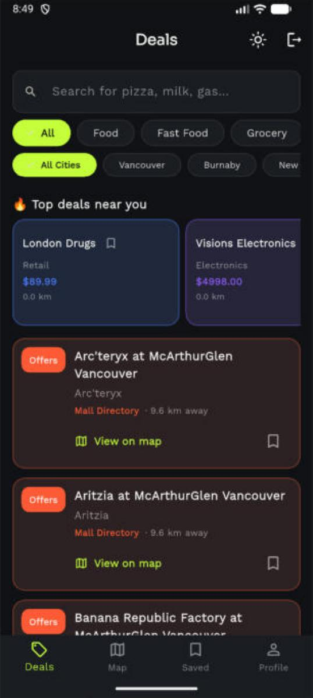
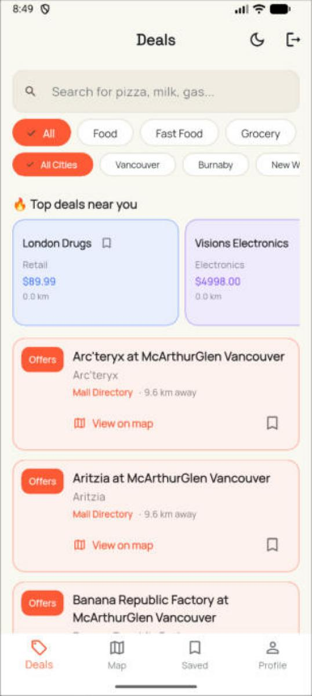
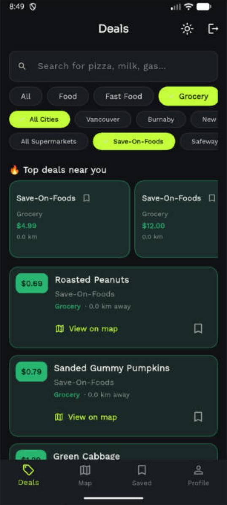
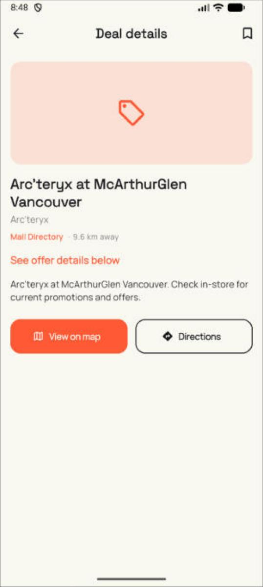
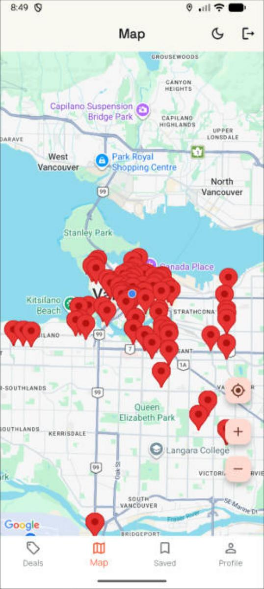
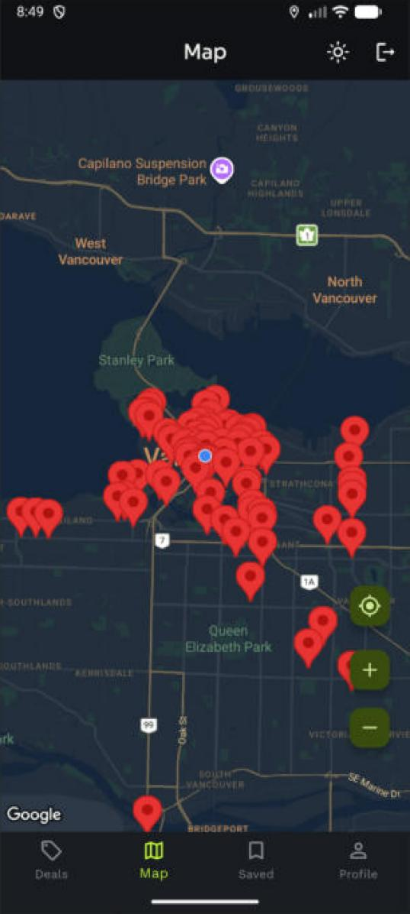
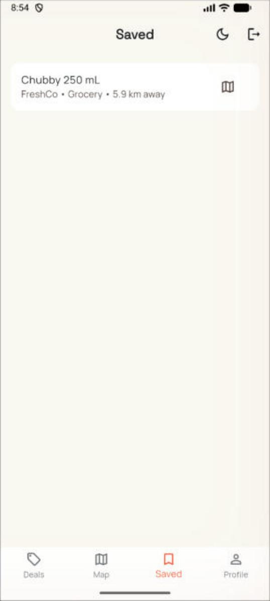
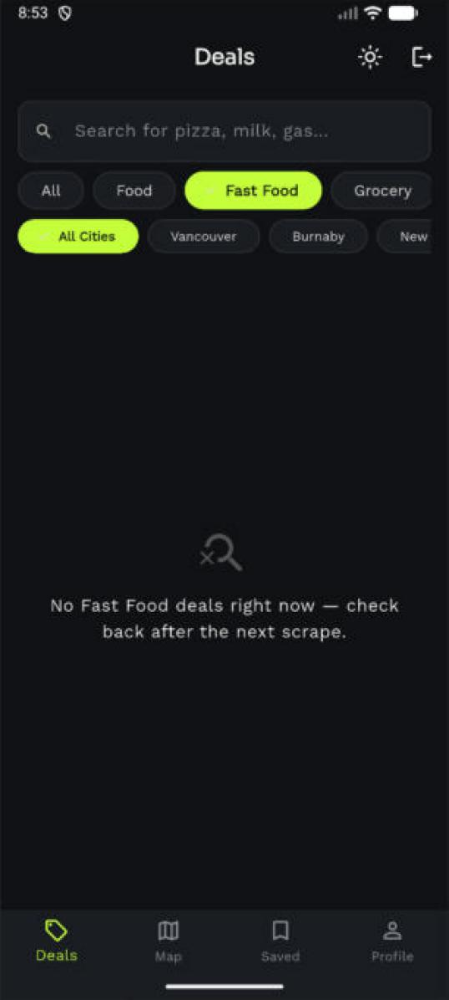
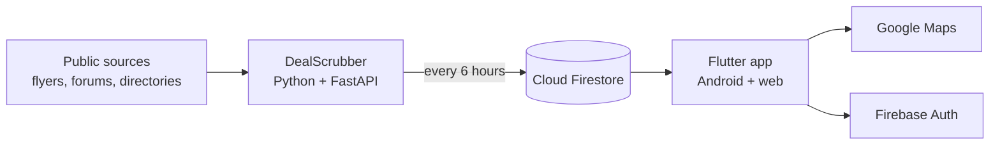

# DealDive

**Real local deals, one live feed, one map.** DealDive is an Android and web app that gathers current deals around Metro Vancouver (groceries, gas, restaurants, happy hour, retail, student discounts and more) and shows them in a searchable feed and on a map.

A Python service collects the deals from named public sources every six hours and saves them to Cloud Firestore. The Flutter app reads them live. Nothing is generated or filled in as a placeholder: every deal comes from a real source.

<p>
  
  
  
  
</p>
<p>
  
  
  
  
</p>

## What you can do

- Browse live deals and narrow them by category, city and search.
- Filter grocery deals by store (Save-On-Foods, Safeway, No Frills, Walmart, T&T, Costco and more), happy hour by weekday, and Black Friday offers by mall.
- See every deal pinned on a map, jump from a deal to its pin, and use the my-location and zoom controls.
- Save deals to your account and come back to them later. Guests can sign in anonymously.
- Switch between light and dark themes with one tap. The map follows the theme.
- Pull to refresh. Loading skeletons and empty states explain what is happening instead of showing a blank screen.

## How it works



The two parts only meet in Firestore. The backend writes deals with the Firebase Admin SDK. The app reads deals and keeps each user's saved deals in a private space that only that user can open.

| Part | Folder | Role |
| --- | --- | --- |
| App | `dealdive_clean_new/` | Flutter app with Firebase Auth, Firestore and Google Maps |
| Backend | `dealscrubber/` | Python and FastAPI service that runs the scrapers on a 6-hour cycle |

## Where the deals come from

| Category | Source |
| --- | --- |
| Grocery | Flipp public flyer search, by store and by product term |
| Retail and Electronics | Flipp flyer search, by category and by merchant |
| Happy Hour | happyhourvancouver.ca, scraped per venue |
| Fast Food | RedFlagDeals Food & Drink and Hot Deals forums |
| Gas | Citywide price forecast, shown as a city price and not as per-station pricing |
| Restaurant | Curated Vancouver spots and Scout Magazine RSS |
| Student | Verified UBC and BCIT discount programs |
| Black Friday | McArthurGlen Vancouver, Tsawwassen Mills and Metropolis at Metrotown tenant lists |
| Mall Directory | Mall tenant listings (no price, kept apart from priced Retail deals) |

Grocery and retail deals are collected for eight cities: Vancouver, Burnaby, New Westminster, Richmond, Surrey, Delta, Langley and Abbotsford. Each deal carries its city and, where it applies, its currency.

## Run it locally

**Requirements:** Flutter, Python 3.10 or newer, a Firebase project with Firestore and Anonymous Auth turned on, and a Google Maps API key.

**App**

```bash
cd dealdive_clean_new
flutter pub get
flutter run
```

Add your own Firebase configuration and Google Maps key as described in the Firebase and `google_maps_flutter` setup guides. Restrict the Maps key to your app's package name and your web domain.

**Backend**

```bash
cd dealscrubber
pip install -r requirements.txt
uvicorn main:app --reload
```

The backend needs a Firebase service-account key at `dealscrubber/firebase_credentials.json`. That file is listed in `.gitignore` and must never be committed.

## Security

Firestore rules let anyone read deals but allow no writes from clients, so only the backend can add or change them. Users can read and write only their own saved deals.

## Known limits

- Some mall and fast-food sources show prices only on JavaScript-rendered pages, which the scrapers cannot read yet.
- Many deals sit at an approximate city location, not the store's exact address.
- The backend has to keep running to refresh data. It is not deployed to always-on hosting yet.
- Runs on Android and web. An iOS build needs a Mac or a cloud build service.

## Roadmap

- Always-on backend hosting
- Per-city map centring and a Bangalore edition with rupee pricing
- Push alerts for saved deals
- Publish to Google Play, and an iOS build

## License and author

Released under the [MIT License](LICENSE). Built by Karthigeyan Shivakumar in Vancouver, BC.
